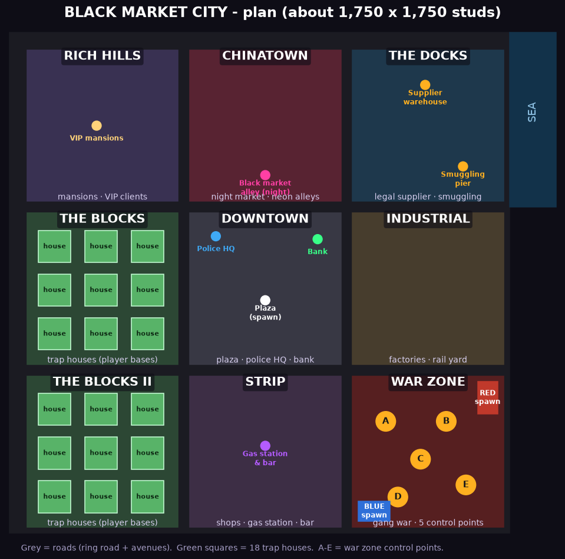

# BLACK MARKET — Game Design Document

> Nom de travail. Titre alternatif pour la page Roblox : "Blaster Dealers".
> Version du doc : 0.1 — 26/09/2026

## 1. Le pitch en une phrase

Tu arrives en ville avec une table pliante et 500 $. Tu construis ton propre repaire de dealer d'armes, tu conçois tes armes à ta marque, tu les vends aux deux camps d'une guerre de gangs, et tu caches ta contrebande quand les inspecteurs débarquent.

## 2. La vibe (référence : Criminality)

- **Ville sombre et vivante** : ruelles, néons qui grésillent, pluie la nuit, flaques qui reflètent les enseignes, métro aérien, entrepôts, parking souterrain.
- **Palette** : bleu nuit, violet, orange sodium des lampadaires, vert néon pour l'argent.
- **Son** : instrumental trap / lo-fi dans les planques, ambiance ville (sirènes lointaines, pluie, chiens) dehors, musique qui s'intensifie pendant une descente.
- **Look des dealers** : costume, hoodie, lunettes noires, chaîne, mallette. Emotes : compter les billets, poignée de main, hochement de tête.
- **UI** : style "téléphone de dealer" (un faux smartphone pour les commandes, messages, carte, banque).
- **Armes** : univers fictif, style stylisé (blasters, armes néon, armes à énergie). Pas de marques réelles, pas de sang, élimination = "K.O." avec ragdoll et étoiles. Ça garde la vibe Criminality sans verrouiller le jeu en 17+ ; vérifier le questionnaire de maturité Roblox avant publication.

## 3. Boucle de jeu principale

```
 Récupérer des pièces  →  Fabriquer à l'établi  →  Exposer en vitrine
        ↑                                                  ↓
 Réinvestir (construction, machines, rareté)  ←  Vendre (PNJ + joueurs)
                         ↕
          Cacher la contrebande / survivre aux descentes
```

Session type (20 à 40 min) : 1 cycle jour + 1 cycle nuit, 1 à 2 descentes, 1 événement serveur.

## 4. Les rôles

Chaque joueur choisit librement et peut changer au spawn :

| Rôle | Ce qu'il fait | Comment il gagne |
|---|---|---|
| **Dealer** (rôle principal) | Construit sa planque, fabrique, vend | Ventes, commissions de marque, contrats |
| **Soldat** (camp Rouge ou Bleu) | Se bat dans la zone de guerre, achète ses armes aux dealers | Primes d'élimination, objectifs de zone |
| **Inspecteur** (débloqué niveau 10) | Enquête, fait des descentes, saisit la contrebande | % de la valeur saisie |

Les PNJ remplissent chaque rôle quand il manque des joueurs, pour que le jeu soit fun même à 3 sur un serveur.

## 5. Pilier 1 — La planque (construction libre)

> Mise à jour : la planque est une **trap house** (belle maison dehors, business au sous-sol). Voir §20.

- Chaque dealer reçoit un **terrain** (petit au départ, extensible) dans un quartier.
- **Mode construction** (touche B / bouton mobile) : caméra aérienne, grille de 1 stud (option 0,5), rotation 45°, déplacer, supprimer, copier, annuler.
- **Catégories d'objets** :
  - Structure : murs, sols, portes, fenêtres, escaliers, toits, grillages.
  - Fonctionnel : comptoir de vente, vitrine, présentoir mural, établi, étagère de stock, coffre-fort, caisse enregistreuse, stand de tir d'essai.
  - Secret : faux mur, trappe, bibliothèque pivotante, sol amovible, compartiment de véhicule.
  - Sécurité : caméras, alarme, porte blindée, détecteur de mouvement.
  - Ambiance : néons (couleur choisie), enseigne avec ton nom, graffitis, plantes, canapés, enceintes (choix de la musique), tapis.
- Chaque objet fonctionnel a **3 à 5 niveaux** (bois → métal → verre blindé → luxe), qui changent son look ET ses stats.
- **Limite d'objets** par terrain (ex. 400, puis 800 avec extension) pour que ça tourne sur mobile.
- La planque est **sauvegardée** et rechargée à chaque connexion.
- **Note de la planque** (étoiles) calculée à partir de : déco, propreté, vitesse de service, variété du stock. Plus la note est haute, plus il y a de clients PNJ.

## 6. Pilier 2 — L'établi (armes à ta marque)

- Une arme = **5 emplacements** : Corps, Canon, Crosse, Viseur, Chargeur (+ Peinture en cosmétique).
- Chaque pièce a une **rareté** : Commun, Peu commun, Rare, Épique, Légendaire.
- Chaque pièce modifie des stats : Dégâts, Cadence, Portée, Précision, Recharge.
- **Valeur de l'arme** = somme des valeurs des pièces × multiplicateur de rareté × bonus de synergie (pièces du même "set").
- L'arme porte **ta marque** (nom de la planque). Quand un soldat met K.O. un ennemi avec ton arme, le kill feed affiche "by [TaMarque]" et tu touches une **commission** (petite, plafonnée).
- **Animation de fabrication** : les pièces flottent au-dessus de l'établi, s'emboîtent une par une avec étincelles, l'arme tourne sur elle-même, la rareté éclate en couleur.
- Recettes découvertes = codex à compléter (collection).

## 7. Pilier 3 — La vente et l'expérience client

### Clients PNJ
- Arrivent par la rue, entrent dans la planque, font la queue.
- Bulle au-dessus de la tête : ce qu'ils veulent (catégorie + budget).
- **Personnalités** : Pressé (patience courte, pourboire élevé), Radin (négocie), Collectionneur (veut du Rare+), Fidèle (revient si bien servi), Louche (nuit seulement, contrebande, paie ×2).
- Barre de patience. Si elle est vide, il part en râlant et la note baisse.

### Joueurs soldats
- Entrent dans la planque, un menu boutique s'ouvre avec les armes en 3D qui tournent (ViewportFrame), prix, stats, marque.
- Peuvent **tester** au stand de tir si la planque en a un.

### Le moment du deal (animation signature)
1. Le client pose sa mallette, elle s'ouvre.
2. L'arme se soulève de la vitrine, tourne, brille, se range.
3. Poignée de main + billets comptés.
4. Caisse "ka-ching", billets qui volent jusqu'au compteur, compteur qui rebondit.
5. **Combo** : ventes enchaînées en moins de 8 s → ×1,1, ×1,2, … jusqu'à ×2 avec musique qui monte.
6. **Grosse commande** : ralenti, pluie de billets, légère secousse caméra.

### Prix
- Le dealer fixe son prix par arme (ou "prix conseillé" automatique).
- Les PNJ acceptent selon leur budget et leur personnalité ; trop cher = refus visible ("Trop cher, frère").
- Les joueurs comparent les planques : vraie concurrence.

## 8. Pilier 4 — Chaleur et descentes (inspecteurs)

- Chaque planque a une jauge de **Chaleur** (0 à 100).
  - Monte avec : ventes de contrebande, contrebande visible, ventes la nuit, plaintes de clients, bruit (stand de tir).
  - Descend avec le temps, en payant un indic, en restant "propre".
- Seuils : 30 = patrouille passe devant, 60 = enquête (un inspecteur entre et regarde), 85 = **descente**.
- **Descente** : sirènes, lumières rouge/bleu, la musique change, compte à rebours de 20 s pour cacher le stock. Les inspecteurs fouillent : tout objet de contrebande **visible** ou dans un compartiment **non caché** est saisi. Les compartiments secrets ont une chance d'être trouvés selon leur niveau.
- Contrebande saisie = perdue (jamais l'argent déjà en coffre). Amende proportionnelle.
- Inspecteur joueur : scanner, mandat (limité par temps), fouille ; il gagne un % de la saisie.
- Anti-frustration : une planque ne peut pas subir plus d'une descente toutes les 10 min ; les nouveaux joueurs (< niveau 5) sont protégés.

## 9. Pilier 5 — Approvisionnement

- **Fournisseur légal** (boutique du port) : pièces Commun / Peu commun, prix fixes.
- **Marché noir** (ruelle, la nuit) : pièces Rare+ en stock limité, prix qui bougent selon la demande du serveur.
- **Missions de contrebande** : récupérer une cargaison au port et la ramener en camionnette en évitant les checkpoints (PNJ + inspecteurs joueurs). Récompense : pièces rares.
- **Récupération** : après les combats dans la zone de guerre, des caisses de pièces apparaissent ; les soldats peuvent les revendre aux dealers.
- **Convois** : un dealer peut faire livrer une grosse commande par convoi PNJ ; le camp adverse de son client peut l'attaquer.

## 10. Pilier 6 — La guerre de gangs (Rouges vs Bleus)

- Une zone de guerre en bordure de ville avec des **points de contrôle** (3 à 5).
- Manche de 15 min, le camp qui tient le plus de points gagne.
- Les soldats gagnent de l'argent en jouant et **doivent acheter** leurs armes (ils gardent une arme de base gratuite faible).
- **La méta crée la demande** : les ventes par catégorie sont suivies ; l'écran de la ville affiche ce qui se vend.
- **Réputation par camp** : vendre aux Rouges augmente ta réputation Rouge, baisse légèrement ta réputation Bleue. Réputation haute = remises de clients fidèles, contrats. Vendre aux deux camps = rentable mais risqué.
- **Fin de manche = krach** : la demande de la catégorie dominante chute de 50 % pendant 3 min.

## 11. Pilier 7 — Jour / nuit

- Cycle de 16 min : 10 min jour, 6 min nuit (réglable dans la config).
- **Jour** : clients normaux, vente légale, chaleur qui descend plus vite.
- **Nuit** : marché noir ouvert, clients Louches, pluie fréquente, néons, prix ×1,5 sur la contrebande, chaleur qui monte plus vite, plus de descentes.

## 12. Pilier 8 — Crews et territoires

- Crew de 2 à 6 joueurs, planque partagée (ou planques voisines connectées).
- La ville = **6 quartiers** : Port, Chinatown, Centre, Zone industrielle, Banlieue, Quartier riche.
- Contrôle d'un quartier = total des ventes des membres dans le quartier sur la semaine.
- Bonus du quartier contrôlé : +10 % clients, pièces moins chères chez le fournisseur local, couleur du crew sur les néons du quartier.
- Guerres de territoire hebdomadaires, classement des crews.

## 13. Événements serveur (toutes les 8 à 12 min, un au hasard)

- **Enchère noire** : une pièce légendaire mise aux enchères en direct, tout le serveur voit les offres.
- **Embargo** : une catégorie interdite 10 min → devient contrebande, prix ×3 au marché noir.
- **Grande offensive** : un camp attaque, demande ×2 pendant 5 min.
- **Pénurie** : un type de pièce disparaît du fournisseur légal.
- **Vague d'inspection** : chaleur de toutes les planques +20.
- **Client VIP** : un PNJ doré qui achète une arme Épique+ à prix ×3 au premier qui l'a.

## 14. Progression

- **Niveau de dealer** (XP par vente, fabrication, mission).
- **Réputation** de la marque (étoiles moyennes + ventes).
- Déblocages : nouveaux objets de construction, pièces, extensions de terrain, rôle Inspecteur, crews.
- **Prestige** ("Nouvelle identité") : repart de zéro avec un multiplicateur permanent et un cosmétique.
- **Saisons** de 6 à 8 semaines avec passe gratuit, récompenses cosmétiques, classement.
- Classements : plus riche, meilleure marque, plus de K.O. avec ses armes, crew dominant.

## 15. Économie (valeurs de départ, toutes dans `src/shared/Config`)

| Élément | Valeur |
|---|---|
| Argent de départ | 500 $ |
| Pièce Commune (fournisseur) | 20 à 60 $ |
| Multiplicateurs de rareté | Commun 1, Peu commun 1,6, Rare 2,8, Épique 5, Légendaire 10 |
| Bonus de set (5 pièces même set) | +25 % |
| Prix conseillé = valeur de l'arme × | 1,4 |
| Budget client PNJ | valeur conseillée × aléatoire 0,8 à 1,3 |
| Combo | +0,1 par vente en < 8 s, max ×2 |
| Commission de marque par K.O. | 2 % de la valeur de l'arme, max 25 $ |
| Taux d'intérêt coffre | aucun (le coffre protège, il ne rapporte pas) |
| Amende de descente | 25 % de la valeur saisie |

À équilibrer en jouant. Aucune valeur en dur dans le code.

## 16. Monétisation (propre et conforme)

- **Gamepasses** : Terrain XL, Double établi, Vendeur PNJ embauché (vend quand tu es absent de ton comptoir), VIP (néons animés, tag), Radio (musique perso).
- **Produits développeur** : boosts temporaires fixes (×2 XP 30 min), cosmétiques (peintures, tenues, emotes).
- **Pas d'objets aléatoires payants au lancement.** Les caisses de pièces s'achètent uniquement avec l'argent du jeu, et cet argent ne s'achète pas en Robux. Si un jour on ajoute des caisses payantes : afficher toutes les probabilités avant l'achat et utiliser `PolicyService:GetPolicyInfoForPlayerAsync` → `ArePaidRandomItemsRestricted`.
- Pas de pari simulé. Pas d'échange d'argent contre Robux entre joueurs.
- Pas de pay-to-win brut en zone de guerre : les Robux achètent du confort et du style, pas des armes surpuissantes.

## 17. Technique (résumé, détails dans `CLAUDE.md`)

- Rojo + Git, Luau strict.
- Toute la logique métier en modules purs dans `src/shared/Logic`, testés avec Lune dans le cloud.
- Le serveur fait autorité sur tout ce qui a de la valeur. Le client ne fait que l'affichage, les animations et envoyer des intentions.
- Sauvegarde : ProfileStore (session locking) pour les profils et les planques sérialisées.
- Cible mobile : budgets de parties, particules et objets par planque.

## 19. La map — Black Market City



- **Taille** : environ 1 750 × 1 750 studs (ordre de grandeur de Criminality), en grille de 3 × 3 quartiers de 520 studs séparés par des avenues de 40 studs, avec un périphérique autour et la mer à l'est.
- **Serveurs** : 18 trap houses → serveurs de **18 à 24 joueurs** (dealers + soldiers + inspecteurs).

| Quartier | Rôle dans le jeu |
|---|---|
| **The Blocks** et **The Blocks II** | 18 trap houses (les bases des joueurs), terrain de basket, épicerie de nuit, points de recrutement |
| **Downtown** | Place centrale (spawn), commissariat (inspecteurs), banque, écran géant des ventes |
| **Chinatown** | Ruelle du marché noir (la nuit), néons, restaurants, événements (enchère noire) |
| **The Docks** | Fournisseur légal (entrepôt), conteneurs, jetée de contrebande (missions) |
| **Industrial** | Usines, gare de triage, caisses de récupération, courses-poursuites |
| **Strip** | Station-service, bar, boutiques (cosmétiques), clients PNJ de passage |
| **Rich Hills** | Villas, clients VIP, plus tard les maisons de prestige |
| **War Zone** | Zone industrielle en ruine, clôturée, 5 points de contrôle A–E, spawn Rouge et spawn Bleu |

### Optimisation (obligatoire, cible mobile)
- **StreamingEnabled** activé : le téléphone ne charge que ce qui est autour du joueur. Les grands bâtiments ont `LevelOfDetail = StreamingMesh` (silhouette simplifiée au loin).
- **Peu de modèles différents, beaucoup réutilisés** : façades modulaires (fenêtres, portes, vitrines) en meshes identiques, que Roblox affiche en un seul lot.
- **Seulement les intérieurs utiles** : trap houses, boutiques, commissariat. Les autres immeubles sont des coquilles vides.
- **Budget** : moins de 15 000 pièces pour toute la ville, `CanTouch` et `CanQuery` désactivés sur le décor, `CollisionFidelity = Box` sur les petits objets, lumières sans ombres sauf quelques-unes.
- **La map est générée une fois dans Studio** (commande de construction), puis sauvegardée dans le place : elle ne se reconstruit pas à chaque serveur, et l'associé « visuel » peut la retoucher à la main.

## 20. La trap house (la base du dealer)

- **Dehors, une belle maison** : façade soignée, porche, garage, jardin, clôture, boîte aux lettres, néon « OPEN » quand le dealer vend. De l'extérieur, rien ne dit que c'est une planque. Trois niveaux de maison achetables (bicoque → maison → villa), qui changent la façade et agrandissent le sous-sol.
- **Rez-de-chaussée** : salon décoré (fixe), porte vers l'escalier du sous-sol.
- **Le sous-sol = le business** : c'est là qu'on construit librement (comptoir, établi, vitrines, coffre, compartiments secrets…). Les clients sonnent, entrent, descendent l'escalier et font la queue au comptoir.
- **Pourquoi c'est bien** : ambiance « trap » immédiate ; les descentes de police prennent tout leur sens (la police entre par la porte, tu as 20 s pour cacher la marchandise au sous-sol) ; plus tard, **tunnel de fuite** et **porte blindée** en améliorations.
- **Technique** : le code de construction ne change pas. Le terrain de construction devient le sol du sous-sol (même système de coordonnées locales).

## 21. Le recrutement (crew PNJ gagné par missions)

On ne recrute pas en un clic : chaque recrue doit être **convaincue par une chaîne de missions**. Ça crée du contenu, des histoires et de l'attachement.

### Les rôles
| Rôle | Ce qu'il fait pour toi | Missions pour le convaincre |
|---|---|---|
| **Seller** | Vend au comptoir quand tu n'es pas là | Faire 10 ventes en une nuit sans laisser partir un client |
| **Runner** | Livre les commandes à domicile dans la ville | Livrer un colis à l'autre bout de la ville en temps limité sans se faire contrôler |
| **Gunsmith** | Fabrique plus vite, débloque des recettes | Lui apporter une pièce rare des conteneurs des Docks, puis lui fabriquer une arme Rare+ |
| **Lookout** | Prévient des descentes plus tôt, fait baisser la chaleur | Repérer 3 flics en civil parmi les passants d'un quartier avant la fin du temps |
| **Muscle** | Protège la maison des braquages, aide en guerre de gangs | Gagner une manche en War Zone ou repousser un braquage de ta maison |
| **Driver** | Missions de contrebande en camionnette | Réussir une course depuis la jetée en évitant 2 barrages |

### Le parcours d'une recrue
1. **Rencontre** : des recrues potentielles traînent dans la ville (terrain de basket, arrêt de bus, bar), avec un marqueur discret. Elles changent chaque jour de jeu. Chacune a un nom, une personnalité, des stats (vitesse, charisme, discrétion, loyauté de base) et un niveau de **Street Rep** requis.
2. **Premier contact** : discussion avec des choix de réponses. La personnalité compte : un Muscle respecte la force, un Seller le style.
3. **Chaîne de 2 à 3 missions** propres à son rôle (tableau ci-dessus). Un échec n'est pas définitif, mais la recrue devient plus méfiante (une mission de plus).
4. **Signature** : prime d'embauche + **salaire** payé à chaque jour de jeu, en argent du jeu uniquement.
5. **Vie dans la crew** :
   - la recrue habite ta maison : le nombre de lits dépend du niveau de la maison, donc 1 recrue au départ, jusqu'à 5 ;
   - elle monte de niveau, et tu l'équipes avec **tes propres armes** : ça relie le recrutement à l'établi ;
   - sa **loyauté** monte (payée à l'heure, bien équipée, missions réussies) ou baisse (salaire en retard, recrue arrêtée pas libérée). Une loyauté basse peut la faire **balancer** (+ chaleur) ou **partir chez un rival** ;
   - elle peut être **arrêtée** pendant une descente : tu paies la caution ou tu la perds.
6. **Plus tard** : les autres dealers peuvent débaucher tes recrues en offrant plus.

### Technique
- Un **MissionService** générique (étapes : aller à, livrer, vendre N, fabriquer une rareté, survivre, trouver un PNJ, gagner une manche). Il servira aussi pour la contrebande, les convois et les événements. La logique d'avancement des missions est pure et testée.
- Recrues sauvegardées dans le profil (nom, rôle, niveau, loyauté, équipement).

## 22. Hors périmètre (pour l'instant)

- Marché global entre serveurs (MemoryStore) : plus tard.
- Échange direct d'armes entre joueurs : plus tard, avec système anti-arnaque.
- Véhicules personnalisables : plus tard.
