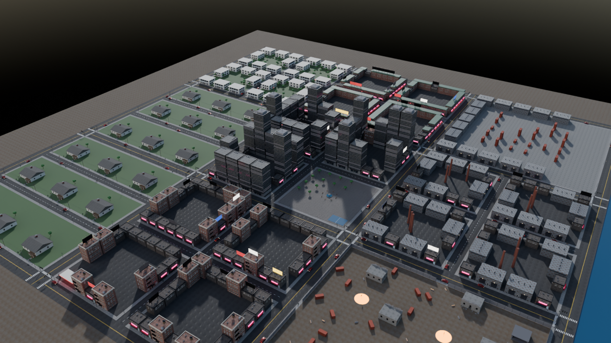

# Installer le projet sur ton PC et le lancer dans Roblox Studio

À faire une seule fois (sauf l'étape 6, à refaire à chaque session de travail).
Le principe : **le code vit dans ce dépôt GitHub**. Rojo l'envoie en direct dans Studio.
Studio sert à tester et à construire la map, pas à écrire les scripts.

---

## 1. Les logiciels

| Logiciel | À quoi il sert | Où le trouver |
|---|---|---|
| **Roblox Studio** | Tester le jeu, construire la map | https://create.roblox.com |
| **GitHub Desktop** (ou Git) | Récupérer le code que Claude a poussé | https://desktop.github.com |
| **Rokit** | Installe Rojo et Lune aux bonnes versions | https://github.com/rojo-rbx/rokit/releases |
| **VS Code** (recommandé) | Lire et modifier le code | https://code.visualstudio.com |

**Installer Rokit (Windows)** : télécharge `rokit-…-windows-x86_64.zip` dans les *Releases*, dézippe-le,
double-clique sur `rokit.exe` (ou lance `.\rokit.exe self-install` dans PowerShell), puis **ferme et rouvre** le terminal.
Sur Mac/Linux : `curl -sSf https://raw.githubusercontent.com/rojo-rbx/rokit/main/scripts/install.sh | bash`.

Dans VS Code, installe les extensions **Rojo** (evaera) et **Luau Language Server** (JohnnyMorganz).

## 2. Récupérer le code

Dans GitHub Desktop : *File → Clone repository → `noeslim/roblox-game`*, choisis un dossier.
Puis, en haut, *Current branch* → choisis la branche où Claude a travaillé
(ex. `claude/busy-franklin-57kc17`), ou `main` une fois la pull request fusionnée.

## 3. Installer Rojo et Lune

Ouvre un terminal **dans le dossier du projet** (dans VS Code : *Terminal → New Terminal*) :

```bash
rokit install        # réponds "oui" quand il demande de faire confiance aux outils
rojo --version       # doit afficher 7.7.0
lune --version       # doit afficher 0.10.5
lune run tests/run   # doit finir par "... passed, 0 failed"
```

## 4. Installer le plugin Rojo dans Studio

```bash
rojo plugin install
```

Redémarre Studio : un bouton **Rojo** apparaît dans l'onglet *Plugins*.

## 5. Créer le jeu dans Studio (une seule fois)

1. Studio → **New → Baseplate**. Tu peux aussi ouvrir ton `BlackMarket_phase0.rbxl`, ça marche pareil.
2. **File → Publish to Roblox** : crée une nouvelle expérience, nom « Black Market », en **privé**.
   *Sans publication, la sauvegarde (DataStore) ne marche pas.*
3. **Home → Game Settings → Security** : active **Enable Studio Access to API Services**, puis *Save*.
4. **View** : ouvre **Output** et **Command Bar** (on s'en sert pour tester).

## 6. Travailler (à chaque session)

1. Dans le terminal, dans le dossier du projet :
   ```bash
   rojo serve
   ```
   Laisse ce terminal ouvert.
2. Dans Studio : **Plugins → Rojo → Connect**. Les scripts apparaissent dans
   `ReplicatedStorage.Shared`, `ServerScriptService.Server` et `StarterPlayerScripts.Client`.
3. Appuie sur **Play** (F5).

⚠️ **Ne modifie pas les scripts dans Studio** : Rojo les écrase à la prochaine synchro. Modifie-les dans VS Code (ou laisse Claude le faire).
La map, les modèles et les décors que tu construis dans Workspace ne sont **pas** touchés par Rojo. Sauvegarde-les avec *File → Publish* ou *Save*.

## 7. Ce que tu dois voir

> Depuis la phase M : tu apparais dans le **sous-sol de ta trap house** (The Blocks), les clients entrent par la porte d'entrée et descendent l'escalier. La construction se fait dans le sous-sol (la maison au-dessus devient invisible pour toi en mode construction).


Le jeu est **en anglais** pour les joueurs.

- Une **rue de nuit** générée automatiquement (à 300 studs de ta maison, vers +Z) : 8 terrains, bâtiments avec fenêtres allumées, enseignes néon, lampadaires. Ta propre construction dans Workspace n'est pas touchée.
- Ton personnage apparaît **sur ton terrain**, derrière une table pliante (le comptoir), avec un **établi** et deux caisses. Le panneau devant affiche « TonPseudo's Shop ».
- En haut au centre : **☀️ DAY 9:59**. En haut à droite : ton argent et ton niveau (**LV 1**).
- À gauche : le bouton **BUILD**.
- Dans **Output** :
  ```
  [ProfileStore]: Roblox API services available - data will be saved
  [CityService] city built: 8 plots
  [Server] started 8 services: ...
  [DataService] loaded TonPseudo ($500, v2)
  ```

⚙️ Dans **File → Experience Settings → Places**, règle la taille du serveur à **8 joueurs** (il y a 8 terrains).

### Checklist de test de la phase 1

1. **Établi** : approche-toi de l'établi, appuie sur **E**. Onglet CRAFT : les 5 pièces « Street » sont choisies, le blaster tourne dans l'aperçu → **CRAFT**. Tu dois voir les pièces voler, s'assembler et l'arme tourner au-dessus de l'établi.
2. **Fournisseur** : onglet SUPPLIER → achète un set de pièces (l'argent baisse).
3. **Prix** : onglet WEAPONS → boutons − / + / SUGGESTED.
4. **Clients** : au bout de quelques secondes, des PNJ arrivent par la rue, entrent et font la queue devant la table. Le premier affiche ce qu'il veut, son budget ($ / $$ / $$$) et une barre de patience.
5. **Vente** : place-toi près du client, appuie sur **E** (« Deal ») → **OFFER**. Accepté : billets qui volent vers ton compteur, « +$228 », son. Ventes enchaînées en moins de 8 s = **COMBO**.
6. **Construction** : touche **B** (ou bouton BUILD). Caméra du dessus, WASD pour bouger, molette pour zoomer. Choisis un objet en bas → fantôme **vert** (OK) ou **rouge** (bloqué) → clic pour poser, **R** pour tourner, **M** pour déplacer, **X** pour vendre (50 % remboursé). **B** pour sortir.
7. **Sauvegarde** : Stop puis Play → tes meubles, tes armes et ton argent sont toujours là.

Si quelque chose ne marche pas : copie les lignes **rouges** d'Output et envoie-les à Claude.

### Tester la sauvegarde

1. Pendant le Play, dans l'onglet **Test**, clique sur **Current: Client** pour passer en **Server**.
2. Dans la **Command Bar**, tape (remplace `TonPseudo`) :
   ```lua
   game.Players.TonPseudo:SetAttribute("DebugGrant", 250)
   ```
   Le compteur passe à **$ 750**. (Cette commande ne marche que dans Studio.)
3. **Stop**, puis **Play** à nouveau : tu dois retrouver **$ 750**. ✅ La sauvegarde marche.

### Se donner tous les objets (Studio seulement)

En **Server**, dans la Command Bar (remplace `TonPseudo`) :
```lua
game.Players.TonPseudo:SetAttribute("DebugGrant", 100000)   -- argent (les meubles s'achètent avec)
game.Players.TonPseudo:SetAttribute("DebugGiveParts", 10)   -- 10 de chaque pièce d'arme du jeu
game.Players.TonPseudo:SetAttribute("DebugLevel", 10)       -- niveau du dealer
game.Players.TonPseudo:SetAttribute("DebugMission", "night_shift") -- lance une mission (id dans Config/Missions)
game.Players.TonPseudo:SetAttribute("DebugGiveVehicle", "all")      -- toutes les voitures
```

### Mettre la musique et les ambiances

Tous les sons sont vides au départ. Dans **Toolbox → Audio**, cherche un son (« lofi hip hop », « trap beat », « city ambience », « rain », « police siren »…), clic droit → **Copy Asset ID**, puis colle-le dans `src/shared/Config/Soundscape.luau` sous la forme `"rbxassetid://123456"` :
- `Music` : une musique par zone, `Day` et `Night` (la planque, la descente, la War Zone, chaque quartier) ;
- `Ambience` : un fond sonore par quartier.
Une zone vide reprend la musique de `Streets`. En jeu, **N** (ou le bouton ♪ en bas à droite) coupe la musique.

### Tester une descente de police

En **Server**, dans la Command Bar (remplace `TonPseudo`) :
```lua
game.Players.TonPseudo:SetAttribute("DebugHeat", 70)    -- règle la jauge de chaleur (0 à 100)
game.Players.TonPseudo:SetAttribute("DebugRaid", true)  -- descente tout de suite
```
Sans `DebugRaid`, une descente n'arrive qu'au niveau 5 et plus, quand la jauge atteint 85. Pendant les 20 s d'alerte, maintiens **E** sur un compartiment secret (mode construction → onglet **SECRET**) pour y cacher ta contrebande. Studio seulement.

### Passer à la nuit (ou au jour) tout de suite

En **Server**, dans la Command Bar :
```lua
game.ReplicatedStorage:SetAttribute("DebugPhase", "Night")   -- ou "Day"
```
L'horloge du jeu saute au début de cette phase (lumière, pluie, marché noir compris), puis le cycle continue normalement. Studio seulement.

## 9. Importer les modèles 3D (une fois, puis à chaque nouvelle version)

Les comptoirs, l'établi, le coffre, le canapé, les néons et toutes les pièces d'armes existent en vrais modèles 3D dans `assets/BlackMarketMeshes.fbx` (aperçu : `assets/previews/_all.png`). Sans import, le jeu garde les modèles en blocs.

1. Dans Studio : onglet **Home → Import 3D** (ou **File → Import 3D**).
2. Choisis `Documents\roblox-game\assets\BlackMarketMeshes.fbx`.
3. Dans la fenêtre d'import, garde les réglages par défaut (surtout ne coche **pas** « Merge meshes »), puis **Import**.
4. Un modèle **BlackMarketMeshes** apparaît dans Workspace (des dizaines d'objets alignés, c'est normal).
5. Dans **ReplicatedStorage**, crée un dossier nommé **Assets** (clic droit → Insert Object → Folder), s'il n'existe pas.
6. Glisse **BlackMarketMeshes** dans **ReplicatedStorage → Assets**. Le nom doit rester exactement `BlackMarketMeshes`.
7. **File → Save** (ou Publish).
8. Play : dans Output tu dois voir `[ModelFactory] mesh library loaded: ... meshes`, et ta planque utilise les nouveaux modèles.

Quand Claude met à jour les modèles : supprime l'ancien `BlackMarketMeshes` dans Assets et refais les étapes 1 à 7.

**Textures réalistes (briques, asphalte, bardage, tuiles, pavés...)** : le FBX contient aussi 12 textures PBR
(couleur + relief + rugosité, aperçu : `assets/previews/textures_sheet.png`), posées sur de petits carrés nommés
`__swatch__<nom>`. Pour qu'elles soient importées :
- dans la fenêtre d'import, vérifie que **Import Textures / Materials** est coché (c'est le cas par défaut) ;
- l'import prend un peu plus de temps (le fichier fait ~12 Mo) : c'est normal.

**Modèles texturés (version « Map v2 »)** : chaque modèle a maintenant des coordonnées de texture (UV) et ses
propres textures (brique, pierre, béton, métal peint, bois, rouille, toile, tuiles...), elles aussi dans le FBX
(~25 Mo, 23 textures de modèles en plus). À l'import, Studio crée un **SurfaceAppearance** dans chaque MeshPart
concerné : c'est ce qui donne la matière aux façades, corniches, escaliers de secours, caisses... Les modèles
sans texture (vitres, néons, plastique, peinture de voiture) restent en matériau Roblox + couleur.
Pour passer à cette version : supprime l'ancien `BlackMarketMeshes`, **redémarre Studio**, refais l'import (étapes 1
à 7, textures cochées), puis reconstruis la ville (section 10 : `Build()` remplace l'ancienne ville toute seule). Output doit afficher la version `2026-09-27b streets`.

Au lancement (ou quand tu construis la ville, section 10), le jeu lit ces carrés et crée des **MaterialVariant**
`BM_<nom>` dans **MaterialService**. Output affiche `[MapBuilder] 12 textures ready`. Toutes les routes, trottoirs,
façades et maisons les utilisent. Si Output affiche `0 textures`, l'import n'a pas pris les textures : refais
l'import en cochant les textures. Tu peux régler l'échelle d'une texture dans MaterialService → `BM_<nom>` →
**StudsPerTile**.

## 10. Construire la ville dans le place (recommandé, une fois)

Sans cette étape, la ville est construite à chaque lancement de serveur : ça marche, mais c'est plus lent et le streaming (important pour les téléphones) ne peut pas être activé.

1. Fais d'abord l'import des modèles 3D (section 9), sinon la ville sera construite en blocs simples.
2. Avec `rojo serve` connecté, **sans lancer Play**, ouvre la **Command Bar** et exécute :
   ```lua
   require(game.ServerScriptService.Server.Lib.MapBuilder).Build()
   ```
3. Output affiche `[MapBuilder] city built ...`. La ville apparaît dans Workspace (`City`) avec les 18 trap houses (`Hideouts`). Le Baseplate est rangé dans ServerStorage.
4. **Supprime ou déplace tes anciennes constructions de test** qui se trouvent vers le centre (0, 0, 0) : c'est maintenant le Downtown.
5. **File → Save**. Le streaming est activé automatiquement (Workspace → StreamingEnabled).
6. **File → Experience Settings → Places** : **Max Players = 24**.

**Important :** la Command Bar garde en mémoire les scripts déjà lancés. Après un `git pull`, **ferme et rouvre Studio** (puis reconnecte Rojo) avant de relancer la commande, sinon c'est l'ancienne version qui construit la ville. La première ligne de l'Output, `[MapBuilder] version ...`, indique la version utilisée.

Pour régénérer la ville (après une mise à jour de Claude), relance la même commande : elle remplace `City` et `Hideouts`. Si tu as retouché la map à la main, fais une copie avant.



## 11. Réglages pour le rendu réaliste

- **Éclairage Future** (ombres et reflets réalistes) : Explorer → **Lighting** → Properties → **Technology = Future**. Sauvegarde.
- **Sons d'ambiance** : dans le Toolbox, onglet Audio, cherche « city ambience loop », « rain loop », « police siren distant ». Clic droit → Copy Asset ID, puis colle les ids dans `src/shared/Config/World.luau` (section `Sounds`) sous la forme `"rbxassetid://123456"`.
- **Animations maison** (optionnel) : les animations du deal sont faites par le code et marchent déjà. Si tu crées tes propres animations avec l'Animation Editor, publie-les et colle leur id dans `src/shared/Config/Animations.luau` (section `Custom`) : elles remplacent automatiquement celles du code.

### Remplacer les modèles provisoires par de vrais modèles 3D

Les objets et armes sont faits de pièces simples générées par le code. Pour mettre tes propres modèles :
1. Crée dans Studio un dossier `ReplicatedStorage > Assets > Buildables` (en dehors des dossiers gérés par Rojo, donc crée-le à la main dans Studio et sauvegarde le place).
2. Mets-y un Model nommé exactement comme l'id de l'objet (ex. `counter_wood`, liste dans `src/shared/Config/Buildables.luau`), à la bonne taille, pivot au centre.
3. Le jeu utilisera automatiquement ton modèle à la place du modèle provisoire.
Même principe pour les armes : `Assets > Weapons > Street` (nom du set).

## 12. Rendre la ville réaliste : kits officiels Roblox + plugins

C'est comme ça que sont faites les belles maps Roblox : des **kits modulaires** (murs, fenêtres, portes, escaliers de secours, climatiseurs… en vrais modèles texturés), des **matériaux réalistes** (MaterialVariant : briques sales, béton taché, asphalte fissuré), des décalques de saleté, beaucoup de petits objets, et l'éclairage Future. Roblox fournit gratuitement un kit de ville complet et de très bonne qualité.

### A. Les matériaux réalistes (5 minutes, effet immédiat)
1. Toolbox → Creator Store → cherche **« Modern City Materials Pack »** (créateur : **Roblox**). Insère-le.
2. Il contient des **MaterialVariant** : mets-les dans **MaterialService** (Explorer), s'ils n'y sont pas déjà.
3. Relance la construction de la ville (section 10). Output affiche `custom materials applied to … parts` : routes, trottoirs, briques, béton et bois de toute la ville utilisent ces textures.

N'importe quel autre pack de MaterialVariant marche pareil : le jeu applique automatiquement chaque variante aux pièces de la même matière de base.

### B. Les vrais bâtiments (le gros du rendu)
1. Toolbox → cherche **« Modular Building Kit - Modern City »** (créateur : **Roblox**). Insère-le.
2. Clic droit dessus → **Save to File…** → `ModernCityKit.rbxm`. Fais pareil avec le pack de matériaux.
3. **Envoie-moi ces fichiers `.rbxm` dans le chat** (comme ton `.rbxl` au début) : je les analyse et j'écris l'assemblage automatique de tous les bâtiments de la ville avec les pièces du kit.

En attendant (ou pour vos propres créations) : n'importe quel Model placé dans `ReplicatedStorage > Assets > Buildings > <type>` remplace ce type de bâtiment partout dans la ville. Les types sont `apartment`, `shop`, `office`, `tower`, `warehouse`, `chinatown`, `mansion` et `ruin`. Le modèle doit avoir **l'entrée vers +Z**, et il est redimensionné pour tenir sur l'emplacement. Si tu mets un **Folder** avec plusieurs Models, le jeu en tire un au hasard pour chaque bâtiment. Même principe pour les objets de rue : `Assets > Props > lamp`, `car`, `tree`, `bench`, `trashcan`, `hydrant`, `container`, `barrier`…

### C. Les plugins Studio utiles pour construire à la main
À installer depuis le Creator Store (onglet Plugins du Toolbox). Tu en as déjà une partie :
| Plugin | À quoi il sert |
|---|---|
| **Building Tools by F3X** | Construire / redimensionner vite et précisément |
| **Archimedes** | Faire des arcs, courbes, routes courbes à partir d'une pièce |
| **GapFill & Extrude** | Remplir les trous entre deux pièces (déjà installé) |
| **Brushtool** | « Peindre » des objets en masse : herbe, déchets, arbres (déjà installé) |
| **Model Reflect** | Symétrie de modèles (déjà installé) |
| **Part to Terrain** | Transformer des pièces en terrain réaliste (déjà installé) |
| **Resurface / Beveler** | Arrondir les bords, changer les surfaces |
| **Tag Editor** | Voir / poser les tags (NightLight, NightGlow, FlickerSign…) |
| **Performance Heatmap** | Repérer ce qui fait ramer la map (important pour mobile) |
| **Moon Animator 2** | Faire de vraies animations (deal, poignée de main…) |

Avec la ville générée comme base (routes, maisons, gameplay déjà branché), l'associé « visuel » peut ensuite retoucher à la main : ruelles, graffitis, déchets, intérieurs. La commande de construction écrase `City` : garde une copie avant de la relancer.

## 8. Récupérer le travail de Claude

1. Claude pousse sur une branche `claude/...`. Sur GitHub, fusionne la pull request (ou reste sur la branche).
2. GitHub Desktop → **Fetch origin** → **Pull**.
3. Si `rojo serve` tourne déjà, Studio se met à jour tout seul. Sinon, refais l'étape 6.
4. Teste. Si ça marche, passe à l'étape suivante de `docs/ROADMAP.md`.

## Problèmes fréquents

| Symptôme | Solution |
|---|---|
| `rokit` / `rojo` : commande introuvable | Ferme et rouvre le terminal (ou redémarre le PC) après avoir installé Rokit. |
| Rojo : *Connect* ne fait rien | Vérifie que `rojo serve` tourne et que le port affiché est `34872`. |
| Output : `Roblox API services unavailable - data will not be saved` | Étape 5 : le jeu doit être publié ET l'accès aux API activé. |
| Tu es kick : « Impossible de charger tes données » | Coupure DataStore : relance Play. Si ça revient, copie la ligne `[DataService]` d'Output à Claude. |
| Le compteur reste sur `...` | Le profil ne s'est pas chargé : regarde les erreurs rouges dans Output. |
| Tu veux tester sans toucher aux vraies sauvegardes | Dans `src/shared/Config/Data.luau`, mets `UseMockInStudio = true`. |
